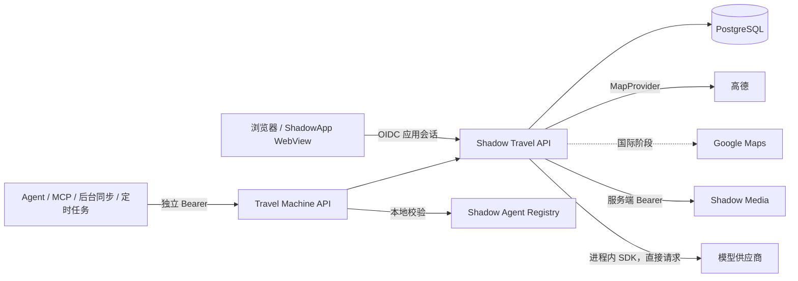

# Shadow Travel 技术架构

## 1. 架构结论

Shadow Travel 采用“模块化单体后端 + 独立 SPA/PWA 前端 + PostgreSQL”的首期架构。部署时只有一个规范入口 `https://example.com/travel/`；其他域名仅在反向代理层返回 308，不承载应用、Cookie 或 OIDC callback。

后端是权限和数据边界。浏览器只持有 Travel 自己的短会话 Cookie；地图密钥、Media 凭据、LLM 供应商密钥和 Agent registry 均不进入浏览器。首期不拆微服务，模块之间通过明确的领域接口隔离，以便将来单独扩展图片处理、导入任务或 Agent 执行器。



## 2. 代码边界

计划目录：

```text
server/src/shadow_travel/
├── api/             # browser、machine、health 路由
├── auth/            # OIDC、会话和用户映射
├── domain/          # 地图、地点、到访、路线等业务规则
├── infrastructure/  # 数据库、审计和任务实现
└── integrations/    # map、media、llm、agent 适配
web/                 # 移动端优先 SPA/PWA
server/migrations/   # Alembic 迁移
server/tests/        # 单元、集成与安全负向测试
```

领域代码只能依赖协议和领域值对象，不能导入高德、Google、Shadow Media 或模型供应商 SDK。适配层可以依赖 `shadow_sdk`。

## 3. URL 与部署前缀

- FastAPI 内部路由不硬编码 `/travel`，由 `TRAVEL_ROOT_PATH` 配置 ASGI `root_path`。
- 本地开发默认根路径运行；生产必须设置 `TRAVEL_ROOT_PATH=/travel`。
- 外部绝对 URL 由受信任的 `TRAVEL_PUBLIC_ORIGIN` 与 `root_path` 组合，不根据任意 `Host` 或 `X-Forwarded-*` 生成 OIDC callback。
- 前端构建基址、API 地址、PWA manifest、静态资源和 Service Worker scope 都从同一个 base path 生成。
- 前端 `MapSurface` 只依赖 `ClientMapProvider`；高德 JS API 的加载、标记、POI 搜索、逆地理编码与路线解析集中在 AMap 适配层，页面不直接操作 SDK。
- JS API Key/安全码与后端 Web 服务 Key 分开配置。前者按高德协议进入浏览器运行时，后者只由服务端读取并可选生成数字签名。
- 登录后的 return URL 必须是应用前缀下的相对站内路径；拒绝 scheme、host、`//`、反斜杠和路径逃逸。
- 健康检查内部路径为 `/healthz`、`/readyz`，生产外部路径分别是 `/travel/healthz`、`/travel/readyz`。

## 4. 认证与授权

### 4.1 浏览器

只实现 OIDC Authorization Code + PKCE：

1. `/auth/login` 生成不可预测的 `state`、`nonce` 和 PKCE verifier。
2. 服务端只保存上述一次性登录事务的摘要或机密值，并设置短时、HttpOnly 的流程 Cookie。
3. callback 原子消费登录事务，校验 state 后携带 verifier 换取 Token。
4. 使用发行方 discovery/JWKS 校验 ID Token 签名、允许算法、issuer、audience、nonce、过期时间和签发时间。
5. 只有包含 `travel-users` 的身份可以进入；以 `(issuer, subject)` upsert 内部 `shadow_user_id`。
6. Token 用完即丢弃，不写数据库、日志、模板或浏览器；Travel 创建随机、可撤销的服务端会话。

生产会话 Cookie 使用 `Secure`、`HttpOnly`、`SameSite=Lax`、Host-only 和 `Path=/travel/`。本地 HTTP 仅允许在 development 环境关闭 `Secure`，其余属性和认证流程保持一致。

退出分为本地退出与全局退出。二者都先撤销 Travel 会话；全局退出再跳转 issuer 的 end-session endpoint，并使用经过校验的站内返回地址。

### 4.2 机器接口

`/api/machine/v1/**` 不读取浏览器 Cookie，只接受独立 Bearer：

- Agent/MCP 使用 Shadow Agent registry 与 `AgentAuthenticator` 本地校验，audience 固定为 `travel`。
- ShadowApp 后台同步和定时任务使用独立服务凭据，不复用 Agent Token 或用户 Cookie。
- 缺失或无效凭据始终返回 JSON 401；scope 或资源权限不足返回 JSON 403，不发生 OIDC 302。
- 写操作要求 `Idempotency-Key`，在数据库中记录 request hash、结果引用和过期时间；所有写入记录结构化审计。
- Agent 只能声明它自己的身份。目标用户必须由 Travel 根据受信任授权或已保存的委托关系解析，忽略 `actor_sub` 等自报字段。

OIDC 组只负责应用准入；地图成员、邀请、角色、照片可见性和分享权限全部由 Travel 数据库判断。

## 5. MapProvider

地图抽象同时覆盖后端数据服务和前端渲染，不让业务模型依赖 SDK 对象。

后端 `MapProvider` 提供地点搜索、详情、地理编码、逆地理编码、粗略路线和外部地图跳转链接。输入输出使用领域值对象：`GeoPoint` 明确携带 WGS84 或 GCJ-02 坐标系，`ProviderPlace` 携带 provider、provider place ID 和地点快照。

选择规则首期为 `country_code=CN -> AMap`，其他地区预留 `GoogleMapProvider`。地点表保存平台无关快照；来源表保存 provider、平台地点 ID、原坐标和必要来源元数据。坐标转换位于适配层，禁止默默把 GCJ-02 当成 WGS84。

前端通过统一地图端口完成初始化、标记、视野、事件和路线绘制。首期实现 AMap 渲染适配；Google 只保留配置与接口，不进入首期 UI。

## 6. 平台能力适配

### Media

- 浏览器先向 Travel 申请上传；Travel 校验地图/到访权限后，通过 `MediaClient` 向控制面创建上传意图。
- 浏览器只得到一次性上传目标，不得到 Media 服务凭据。
- 完成上传由 Travel 调用控制面确认，业务表只保存 `media_id` 与业务关联元数据。
- 每次读取先由 Travel 判断可见性，再申请短时访问地址；短时 URL 不持久化。
- 照片默认 private。保留拍摄时间、地点文字、经纬度与 EXIF 清理状态字段；GPS 默认不公开，公开/共享输出使用清理后的媒体。
- 当前 Media 契约尚未提供派生缩略图。首期通过上传尺寸限制和按需加载保证可用性，不自行持久化另一套对象地址；缩略图在平台提供稳定派生媒体契约后接入。

### LLM

- 每个模型别名创建进程内 `AsyncLLMClient`，通过平台 registry 读取供应商、Base URL、真实模型与密钥文件。
- 请求由 Travel 进程直接发送供应商，不经过 Shadow Platform 转发。
- 提示词、工具、RAG、地点核验、行程上下文和变更集归 Travel 管理。
- 平台 usage sink 只接收模型别名、供应商、Token、延迟、重试与状态。Travel 的日志和审计也不记录提示词、回答、图片 URL 或旅行正文。
- LLM 未配置或失败时，地图、筛选、导入、路线与协作必须正常使用。

### Agent

- 适配层构造 audience 为 `travel` 的本地 `AgentAuthenticator`。
- 首批 scope 为 `travel.maps.read`、`travel.drafts.create`；直接领域写 scope 后置。
- Agent 读取仍要经过地图成员和字段级可见性判断；创建的内容先进入草案/变更集，不直接落业务表。
- 审计保存 agent ID、owner app、audience、scope、request ID、幂等键和结果摘要，不保存 Bearer 或敏感正文。

## 7. ShadowApp 与 WebView

- SPA 使用标准 History API；页面内返回优先消费历史栈，根页面再交给 ShadowApp 关闭 WebView。
- 登录采用当前顶层页面跳转，不依赖弹窗；callback 与 Cookie 都使用规范主站域名。
- 文件上传使用标准 `<input type="file" accept="image/*">`，支持系统选择器和相机返回的 content URI，不依赖本地文件路径。
- 前台 WebView 使用 OIDC 应用会话；后台同步调用 machine API 并持有独立、最小 scope 的 Bearer。
- 网络中断时先保存本地待同步操作 ID；服务端通过幂等键保证重放安全。首期只搭建协议和健康验证，不承诺完整离线地图。

当前 ShadowApp 对独立 Identity origin 的导航和 Travel 后台任务还缺少壳侧实现，Travel 仓库不使用 Token handoff 等旁路方案。现状、最小壳改动与验收项见 [ShadowApp 接入状态](shadowapp-integration.md)。

## 8. 数据与迁移

PostgreSQL 是生产数据库。领域迁移建立身份、OIDC 流程、会话、主题地图、成员、Place、MapPoint、Preference、Visit、VisitMapShare、VisitRecord、Photo、路线、自定义字段、只读分享、幂等记录和审计表。所有业务标识使用 UUID；时间使用 UTC。主题支持归档，MapPoint 从主题移除时只删除主题关联，绝不级联删除个人到访和记录。

当前尚未形成生产数据基线，领域迁移直接按最终模型重整，开发数据库需要重建。正式产生需保留数据后，迁移只通过 Alembic 前向执行。上线前必须在同版本数据库副本完成升级、启动和回滚演练；应用回滚采用整版回滚，不跨版本混用数据库模型。

## 9. 健康、配置与日志

- `/healthz` 只返回进程存活和版本，不访问数据库、OIDC 或第三方。
- `/readyz` 检查数据库连通性及当前启用的必要本地配置；外部非关键能力降级展示，不拖垮核心地图。
- 配置统一使用 `TRAVEL_` 环境变量；production 启动时拒绝示例值、HTTP origin、非 `/travel` 前缀、非安全 Cookie、缺失 OIDC client secret 和无效 registry 路径。
- 日志使用 request ID 和结构化字段。授权头、Cookie、Token、预签名 URL、提示词、回答和用户旅行正文禁止入日志。

## 10. 开发阶段

1. **工程与安全底座**：配置校验、健康检查、数据库与迁移、prefix-safe URL、OIDC/会话、machine Bearer、平台适配接口、测试和文档。
2. **地图核心**：主题地图、成员、地点库、点位、筛选、AMap 搜索与渲染、北京公园年票导入和到访状态。
3. **记录与媒体**：到访、备注、Media 上传/访问、照片元数据和权限。
4. **粗略路线**：贵阳美食地图、站点排序、AMap 路线与外部跳转。
5. **智能增强**：自然语言查询、地点提取、标签建议、路线草案和可审核变更集。
6. **Agent/MCP 扩展**：稳定读取与草案工具、委托授权、审计、限流和评估；再决定远程 MCP。

首期不部署生产，不加入费用、票务、酒店、论坛或导航级能力。
